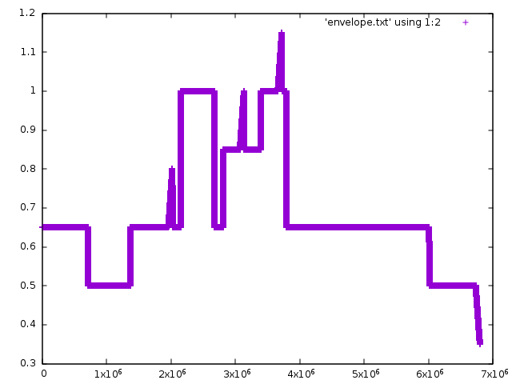

# 5 Dynamics

The Sinsy voice model doesn't have labelled data for dynamics so tags such as
p, mp, mf, and f and crescendo/diminuendo tags are not handled.

The applyDynamicsToWAV.py will post-process a WAV file that was already
generated by Sinsy, and will apply the dynamics tags and crescendo/diminuendo.
Care should be exercised if dynamic compression is later applied which will
reduce the dynamic range.

## applyDynamicsToWAV.py

```
usage: applyDynamicsToWAV.py [-h] [--inxml INXML] --inwav INWAV
                             [--outdynamics OUTDYNAMICS]
                             [--outenvelope OUTENVELOPE] [--outwav OUTWAV]
                             [--pppp PPPP] [--ppp PPP] [--pp PP] [--p P]
                             [--mp MP] [--mf MF] [--f F] [--ff FF] [--fff FFF]
                             [--ffff FFFF] [--sp SP] [--sf SF]
                             [--smoothing SMOOTHING] [--crescendo CRESCENDO]
                             [--diminuendo DIMINUENDO]

optional arguments:
  -h, --help            show this help message and exit
  --inxml INXML         name of the input xml file or stdin if not specified
  --inwav INWAV         name of the input wav file
  --outdynamics OUTDYNAMICS
                        name of output file for dynamics information for
                        debugging (optional)
  --outenvelope OUTENVELOPE
                        name of output file for envelope information for
                        debugging, the resulting file can be plotted using a
                        program like gnuplot (optional)
  --outwav OUTWAV       name of output file for wave or stdout if not
                        specified
  --pppp PPPP           value for dynamic pppp, between 0.0 and 1.0, default
                        is 0.1
  --ppp PPP             value for dynamic ppp, between 0.0 and 1.0, default is
                        0.1
  --pp PP               value for dynamic pp, between 0.0 and 1.0, default is
                        0.2
  --p P                 value for dynamic p, between 0.0 and 1.0, default is
                        0.3
  --mp MP               value for dynamic mp, between 0.0 and 1.0, default is
                        0.4
  --mf MF               value for dynamic mf, between 0.0 and 1.0, default is
                        0.6
  --f F                 value for dynamic f, between 0.0 and 1.0, default is
                        0.8
  --ff FF               value for dynamic ff, between 0.0 and 1.0, default is
                        0.9
  --fff FFF             value for dynamic fff, between 0.0 and 1.0, default is
                        1.0
  --ffff FFFF           value for dynamic ffff, between 0.0 and 1.0, default
                        is 1.0
  --sp SP               value for dynamic sp, between 0.0 and 1.0, default is
                        0.3
  --sf SF               value for dynamic sf, between 0.0 and 1.0, default is
                        0.8
  --smoothing SMOOTHING
                        value for smoothing dynamic changes, represents time
                        percentage of a measure, default is 0.05
  --crescendo CRESCENDO
                        change value for applying crescendo, default is 0.15
  --diminuendo DIMINUENDO
                        change value for applying diminuendo, should be
                        negative, default is -0.15
```

The workflow for using this script is to generate the initial WAV file
either using ```upload.py```, directly using the http://sinsy.jp website, or
by running the ```sinsy``` binary locally if it has been installed.

So now you have an XML file that we'll call ```song.xml```. You also have a
WAV file that you generated from this XML file, we'll call it ```song.wav```.
Now you use this script to process the WAV file using the dynamics information
specified by the ```song.xml``` file.

This will generate a new WAV file with using the dynamics and
crescendo/diminuendo information from the XML file. In this case, the
```--inxml``` argument would be ```song.xml```. The ```--inwav```
argument would be ```song.wav```.  The new WAV file will be written to
```stdout```.

Example usage:

> $ python applyDynamicsToWAV.py --inxml song.xml --inwav song.wav >output.wav

This will read the XML file from ```song.xml```, the WAV file from
```song.wav```, and write the WAV file ```output.wav```

The options ``--p``, ``--f``, and related options allow you to specify the
actual volume (or amplitude) to use when generating the new WAV file.

- *p* means soft (piano)
- *pp* means very soft
- *ppp* means very very soft
- *pppp* means very very very soft
- *f* means loud or strong (forte)
- *ff* means very loud
- *fff* means very very loud
- *ffff* means very very very loud
- *mp* means half soft (mezzo piano)
- *mf* means half loud (mezzo forte)

These notations when used in sheet music are somewhat ambiguous, it is up to
the interpretation of the performer exactly how soft or how loud the music
should be played. Specifying a value of ```--f 1.0``` means that if the dynamics in
the xml file specify *f*, then the value of 1.0 means that the sound samples
for that portion of the WAV file will be unaltered. A value such as 1.5
will increase the volume (amplitude) by 50% by multiplying the sound sample
by 1.5, but clipping is a possibility. A value such as 0.5 will decrease the
volume by 50% by multiplying the sound sample by 0.5.

In order to avoid sudden amplitude changes 
the ```--smoothing``` option can be used to specify how long
it should take for the volume to change. A value of 1.0 means that it will take
an entire measure to change the volume (the change in volume will be linear).
This would be basically the same thing as crescendo or diminuendo since the
change will be very gradual. A smaller value like 0.05 means that the
transition will take place in 5% of the measure time, so it would be rather
quick in this case.

The ```--crescendo``` and ```--diminendo``` options specify how much of an
increase or decrease in volume should be applied. If the current volume is
0.5 and the ```--crescendo``` is 0.15, then the volume will start at 0.5 and
gradually change to 0.65 over the course of the measure. One issue here is
that not all XML files specify exactly how loud or soft the crescendo should
be at the end of the crescendo, so it is mostly just guesswork.

There are a couple of options that can be used to see exactly what is being
done to the WAV file.

The first is the ```--outdynamics``` option. This will output a file that
contains the dynamics information from the XML file.

Example usage:

> $ python applyDynamicsToWAV.py --inxml song.xml --inwav song.wav --outdynamics dynamics.txt >/dev/null

This is an example of what the ```dynamics.txt``` file might look like:

```
{'crescendo': 0, 'dynamics': 'mp', 'diminuendo': 0, 'number': 1}
{'crescendo': 0, 'dynamics': 'mp', 'diminuendo': 0, 'number': 2}
{'crescendo': 0, 'dynamics': 'mp', 'diminuendo': 0, 'number': 3}
{'crescendo': 0, 'dynamics': 'mp', 'diminuendo': 0, 'number': 4}
{'crescendo': 0, 'dynamics': 'mp', 'diminuendo': 0, 'number': 5}
{'crescendo': 0, 'dynamics': 'mp', 'diminuendo': 0, 'number': 6}
{'crescendo': 0, 'dynamics': 'mp', 'diminuendo': 0, 'number': 7}
{'crescendo': 0, 'dynamics': 'mp', 'diminuendo': 0, 'number': 8}
{'crescendo': 0, 'dynamics': 'mp', 'diminuendo': 0, 'number': 9}
{'crescendo': 0, 'dynamics': 'mp', 'diminuendo': 0, 'number': 10}
{'crescendo': 0, 'dynamics': 'mp', 'diminuendo': 0, 'number': 11}
{'crescendo': 0, 'dynamics': 'p', 'diminuendo': 0, 'number': 12}
{'crescendo': 0, 'dynamics': 'p', 'diminuendo': 0, 'number': 13}
{'crescendo': 0, 'dynamics': 'p', 'diminuendo': 0, 'number': 14}
{'crescendo': 0, 'dynamics': 'p', 'diminuendo': 0, 'number': 15}
{'crescendo': 0, 'dynamics': 'p', 'diminuendo': 0, 'number': 16}
{'crescendo': 0, 'dynamics': 'p', 'diminuendo': 0, 'number': 17}
{'crescendo': 0, 'dynamics': 'p', 'diminuendo': 0, 'number': 18}
{'crescendo': 0, 'dynamics': 'p', 'diminuendo': 0, 'number': 19}
{'crescendo': 0, 'dynamics': 'p', 'diminuendo': 0, 'number': 20}
{'crescendo': 0, 'dynamics': 'p', 'diminuendo': 0, 'number': 21}
{'crescendo': 0, 'dynamics': 'mp', 'diminuendo': 0, 'number': 22}
{'crescendo': 0, 'dynamics': 'mp', 'diminuendo': 0, 'number': 23}
...
```

The **number** field indicates the measure, and the **dynamics** field indicates
the dynamics that are applied to that measure. The fields **crescendo** and
**diminuendo** are either true (1) or false (0).

The other option for debugging is the ```--outenvelope``` option, which will
output data that can be plotted using a program like **gnuplot**. The dynamics
information that gets applied to the WAV file can be thought of as an
envelope, similar to an Attack-Delay-Sustain-Release (ADSR) envelope.

Example usage:

> $ python applyDynamicsToWAV.py --inxml song.xml --inwav song.wav --outenvelope envelope.txt >/dev/null

This write the envelope data to the file ```envelope.txt``` which can be plotted
using **gnuplot**. First, run **gnuplot** and at the prompt type:

> gnuplot> plot 'envelope.txt' using 1:2

You should see a graph that looks something like this (depending on the
dynamics):



The x-axis is the sample number (i.e. time) and the y-axis is the amplitude
(i.e. volume).


## printDynamics.py

This will extract and print the dynamics tags (like p, mp, f) in an XML file.

```
usage: printDynamics.py [-h] [xmlfile]

positional arguments:
  xmlfile     name of the xml file or - for stdin

optional arguments:
  -h, --help  show this help message and exit
```

Example usage:

> $ python printDynamics.py input.xml

